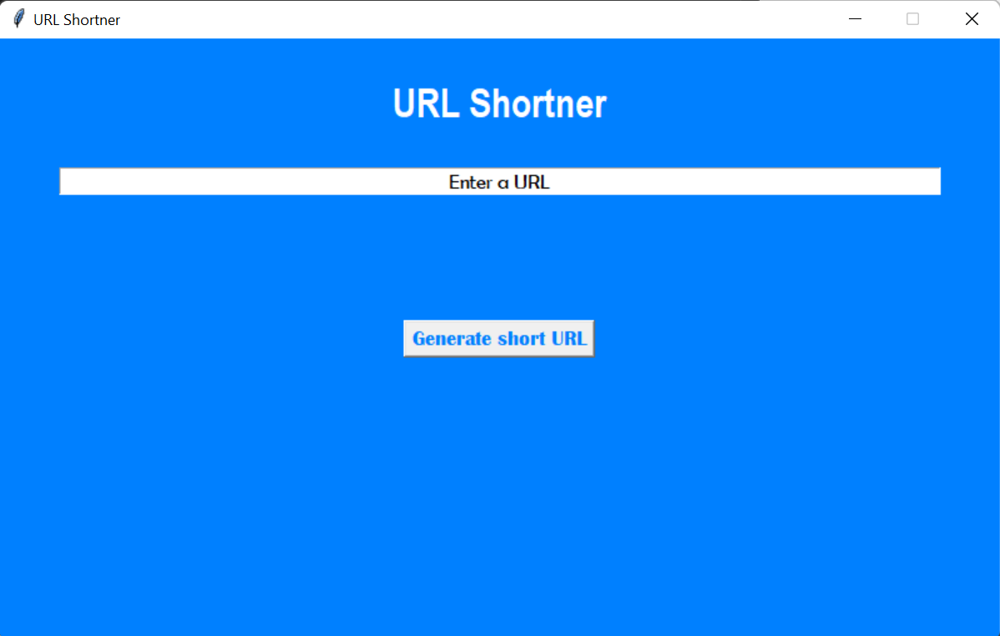

# Simple Python tkinter App

A simple python app using tkinter library.

## Setup Environment
#### Requirement
python 3.x

#### Setup virtual env
1. Create virual env using command `python -m venv venv`
2. Activate the virtual env using 
a. `.\venv\Scripts\activate.bat` for windows
b. `. venv/scripts/activate` for linux
3. Install dependencies by `pip install -r requirements.txt`

#### Running the application
simply `python URL-shortener.py` will start the app

#### Package the app
You need pyinstaller library for this. Install using `pip install pyinstaller`
For windows:
- `pyinstaller URL-shortener.py -w --onefile` 
you will find the exe file inside the dist folder that was created. You can share this exe file to anyone running windows

##### UI
The UI was actual built using `pygubu-designer`, which is an application and it can be installed using `pip install pygubu-designer`